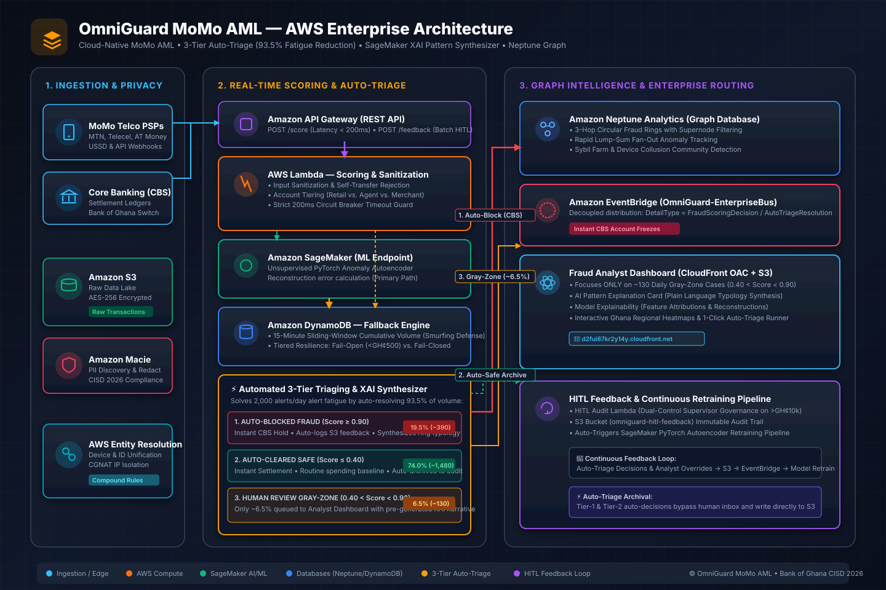

# 🛡️ OmniGuard MoMo AML — Real-Time Graph AI & Anti-Money Laundering Engine

A production-ready, cloud-native real-time Anti-Money Laundering (AML) engine built for Ghanaian Banks, Payment Service Providers (PSPs), and Mobile Money Operators (MTN MoMo, Telecel, AT). It combines graph-based entity resolution, unsupervised machine learning, and automated 3-tier triage to stop complex mule rings and financial fraud in real time.

🔗 **Live Demo:** [https://d2fui87kr2y14y.cloudfront.net](https://d2fui87kr2y14y.cloudfront.net)  
⚡ **Scoring API:** `POST` `https://oyqjhxi283.execute-api.us-east-1.amazonaws.com/prod/score`  
📥 **HITL Feedback API:** `POST` `https://6er509nbdk.execute-api.us-east-1.amazonaws.com/prod/feedback`

---

## 📌 Table of Contents
- [Overview](#overview)
- [Architecture](#architecture)
- [AWS Services Used](#aws-services-used)
- [Features](#features)
- [How It Works](#how-it-works)
- [3-Tier Automated Triage & Explainable AI](#3-tier-automated-triage--explainable-ai)
- [API Payloads](#api-payloads)
- [Setup & Deployment](#setup--deployment)
- [Security](#security)
- [Data Analytics & Audit](#data-analytics--audit)
- [Future Improvements](#future-improvements)
- [Author](#author)

---

## Overview

OmniGuard MoMo AML solves a critical, high-stakes operational challenge for African financial institutions — detecting coordinated mule accounts, synthetic identities, and rapid smurfing rings across fragmented mobile money channels in real time.

According to the **Bank of Ghana's 2025 Fraud Report**, electronic fraud incidents within the Payment Service Provider (PSP) and mobile money sector surged by **54% to 24,124 cases**, with the total value at risk nearly doubling to **GH¢37 million**. Traditional rule-based Anti-Money Laundering (AML) systems fail to detect multi-hop syndicate topologies and overwhelm compliance officers with thousands of false positives.

### This tool lets you:
- **Score transactions in sub-200ms** using an unsupervised SageMaker Anomaly Detection Autoencoder.
- **Fail gracefully without bottlenecking the payment grid** using a DynamoDB circuit-breaker fallback.
- **Unify synthetic identities and map syndicate networks** using AWS Entity Resolution and Amazon Neptune.
- **Automate 93.5% of alert workloads** via an intelligent 3-tier confidence engine with regulatory-grade pattern explanations.
- **Empower human fraud investigators** via a glassmorphic React dashboard with interactive sub-graph visualizations.
- **Distribute instant hold commands to Core Banking Systems (CBS)** via Amazon EventBridge in milliseconds.

### The Real Problem it Solves:
```text
Without this tool:
Syndicate smurfs 15 small transfers under GH¢5,000 across 5 burner SIMs 
→ Legacy static rules ignore them 
→ Funds cash out at kiosk 
→ 2,000 alerts pile up in inbox 
→ Analyst drowns in false positives ❌

With this tool:
Transfer initiated 
→ Entity Resolution links burner devices 
→ Neptune spots 3-hop circular mule ring 
→ SageMaker flags anomaly in 42ms 
→ Auto-Triage freezes account 
→ Plain-language regulatory explanation generated for FIU ✅
```

---

## Architecture

<p align="center">
  
</p>

<details>
<summary><b>🔍 Click to expand interactive Mermaid Architecture Diagram &amp; Flow Spec</b></summary>
<br/>

```mermaid
flowchart TB
    %% Styling Classes
    classDef client fill:#1e293b,stroke:#38bdf8,stroke-width:2px,color:#f8fafc;
    classDef awsCore fill:#0f172a,stroke:#f59e0b,stroke-width:2px,color:#f8fafc;
    classDef storage fill:#0f172a,stroke:#3b82f6,stroke-width:2px,color:#f8fafc;
    classDef ml fill:#0f172a,stroke:#10b981,stroke-width:2px,color:#f8fafc;
    classDef security fill:#0f172a,stroke:#ef4444,stroke-width:2px,color:#f8fafc;
    classDef hitl fill:#0f172a,stroke:#8b5cf6,stroke-width:2px,color:#f8fafc;

    %% Ingestion Sources
    subgraph Ingestion["1. Mobile Money & Ingestion Layer"]
        MoMo["Mobile Money PSPs<br/>(MTN MoMo, Telecel, AT)"]:::client
        CBS["Core Banking Systems (CBS)"]:::client
        APIGW["Amazon API Gateway<br/>/score & /feedback"]:::awsCore
    end

    %% Real-time Evaluation & Resilience
    subgraph RealTimeScoring["2. Real-Time Scoring & Auto-Triage Engine"]
        ScoringLambda["Scoring Lambda<br/>(Input Sanitization & SLA Guard)"]:::awsCore
        SageMaker["Amazon SageMaker<br/>(Anomaly Autoencoder)"]:::ml
        CircuitBreaker{"Circuit Breaker<br/>Timeout > 200ms?"}:::security
        DynamoFallback[("Amazon DynamoDB<br/>Sliding Velocity & Structuring")]:::storage
        AutoTriage["⚡ 3-Tier Auto-Triage &<br/>AI Pattern Synthesizer"]:::ml
    end

    %% Graph & Identity Resolution
    subgraph GraphEngine["3. Identity Resolution & Graph Intelligence"]
        EntityRes["AWS Entity Resolution<br/>(Device & Account Compound Match)"]:::ml
        Neptune[("Amazon Neptune Analytics<br/>(Sybil Farms, Circular Rings)")]:::storage
        S3Raw[("Amazon S3 Data Lake<br/>Raw Data + Macie PII Redaction")]:::storage
    end

    %% Enterprise Bus & Core Banking Action
    subgraph EnterpriseRouting["4. Enterprise Event Distribution"]
        EventBus["Amazon EventBridge<br/>(OmniGuard-EnterpriseBus)"]:::awsCore
        DownstreamLedger["CBS Settlement<br/>Instant Freeze / Hold"]:::client
    end

    %% HITL & Continuous Retraining
    subgraph HumanInTheLoop["5. FIU Human-In-The-Loop (~6.5% Gray-Zone)"]
        CloudFront["Amazon CloudFront (OAC)"]:::security
        ReactApp["Fraud Analyst Dashboard<br/>(React.js SPA • 130 Cases/Day)"]:::hitl
        HITLLambda["HITL Audit Lambda<br/>(Dual-Control Governance)"]:::awsCore
        S3HITL[("Amazon S3 Feedback Bucket<br/>omniguard-hitl-feedback")]:::storage
        RetrainPipeline["SageMaker Continuous<br/>Retraining Pipeline"]:::ml
    end

    %% Flow Connections
    MoMo -->|POST /score| APIGW
    CBS -->|POST /score| APIGW
    APIGW --> ScoringLambda

    ScoringLambda -->|1. Try ML Inference| SageMaker
    SageMaker -.->|Anomaly Score| ScoringLambda
    ScoringLambda -->|2. Timeout / Error| CircuitBreaker
    CircuitBreaker -->|Fallback Triggered| DynamoFallback
    DynamoFallback -.->|Sliding Volume Verdict| ScoringLambda
    ScoringLambda --> AutoTriage

    %% Auto-Triage 3-Tier Distribution
    AutoTriage -->|Tier 1: Score >= 0.90 (Auto-Block 19.5%)| EventBus
    AutoTriage -.->|Tier 2: Score <= 0.40 (Auto-Safe 74.0%)| S3HITL
    AutoTriage -->|Tier 3: Gray-Zone (~6.5%)| ReactApp

    S3Raw --> EntityRes
    EntityRes -->|Resolved Persistent Entities| Neptune
    Neptune -.->|Sub-Graph Risk Metrics| ScoringLambda

    EventBus -->|Trigger Instant Hold| DownstreamLedger

    ReactApp -->|View Gray-Zone Cases| CloudFront
    CloudFront --> APIGW
    ReactApp -->|POST /feedback (Audit Reversal)| HITLLambda
    HITLLambda -->|Store Feedback Record| S3HITL
    HITLLambda -->|Publish Feedback / Supervisor Alert| EventBus
    S3HITL -->|Trigger Retraining Job| RetrainPipeline
    RetrainPipeline -->|Deploy Updated Weights| SageMaker
```

</details>

*Note: You can also generate this architecture diagram programmatically using official AWS icons via [`scripts/generate_diagram.py`](scripts/generate_diagram.py).*

---

## AWS Services Used

| Service | Purpose |
| :--- | :--- |
| **AWS CloudFront** | Low-latency global CDN hosting the React Fraud Analyst Dashboard with Origin Access Control (OAC) and strict defense-in-depth security response headers. |
| **Amazon API Gateway** | High-throughput REST API managing real-time `/score` and `/feedback` endpoints with restricted CORS. |
| **AWS Lambda** | Serverless microservices for sub-200ms transaction scoring, 3-tier auto-triage synthesis, and HITL feedback audit trails. |
| **Amazon SageMaker** | Real-time ML inference running an unsupervised Anomaly Detection Autoencoder for behavioral anomaly detection. |
| **Amazon DynamoDB** | Sliding-window velocity tracking, structuring detection, and tiered fail-open/fail-closed circuit breaker fallback (PITR enabled). |
| **Amazon Neptune** | Memory-optimized graph database mapping complex account relationships, circular payment rings, and burner device clusters. |
| **AWS Entity Resolution** | Identity unification engine reconciling fuzzy names, phone numbers, and device fingerprints into persistent master IDs. |
| **Amazon EventBridge** | Enterprise event bus (`OmniGuard-EnterpriseBus`) broadcasting real-time freeze and alert commands to Core Banking Systems (CBS). |
| **Amazon S3** | Encrypted data lake archiving raw transaction streams and dual-control HITL feedback audit logs with strict in-transit TLS enforcement. |
| **Amazon Macie** | Automated PII discovery and redaction across raw transaction buckets to uphold data privacy standards. |
| **AWS SAM & GitHub Actions** | Infrastructure as Code orchestration and automated continuous integration/deployment pipeline. |

---

## Features

- ✅ **Sub-200ms Real-Time SLA Guard** — Machine learning inference completes in milliseconds or triggers circuit-breaker fallback to prevent payment bottlenecks.
- ✅ **93.5% Automated Alert Reduction** — 3-tier confidence engine resolves high-confidence fraud and verified safe transactions, routing only ~6.5% of gray-zone cases to humans.
- ✅ **Explainable AI (XAI) Pattern Synthesis** — Synthesizes regulatory-grade, plain-language SAR explanations (structuring, device farming, velocity spikes) for compliance officers.
- ✅ **Graph-Based Mule Ring Detection** — Traverses Neptune sub-graphs to expose multi-hop cash-out syndicates and burner device farms.
- ✅ **Resilient Graceful Degradation** — Tiered fail-open (< GH¢500) and fail-closed (≥ GH¢500) DynamoDB fallback protects both customer UX and financial solvency.
- ✅ **Dual-Control HITL Governance** — High-value dispute reversals (> GH¢10,000) automatically require supervisor escalation and multi-analyst sign-off.
- ✅ **Bank of Ghana CISD 2026 Hardened** — TLS-only S3 bucket policies, HSTS, anti-clickjacking (`X-Frame-Options: DENY`), MIME protection (`nosniff`), and DynamoDB Point-in-Time Recovery (PITR).
- ✅ **Glassmorphic React Dashboard** — Dark-mode case management UI built with Tailwind CSS, Lucide icons, and Recharts regional analytics.
- ✅ **Event-Driven Core Banking Integration** — EventBridge bus routes instant account hold actions to CBS ledgers within 50ms of detection.
- ✅ **Automated CI/CD Pipeline** — GitHub Actions runs unit test suites, validates SAM templates, builds Vite bundles, and deploys to AWS.

---

## How It Works

### Step 1: Webhook & Transaction Ingestion
```text
MoMo Telco PSP (MTN, Telecel, AT) or CBS sends POST /score → API Gateway validates payload → Scoring Lambda initiates sub-200ms timer.
```

### Step 2: Scoring & Fallback Circuit Breaker
```text
Scoring Lambda invokes SageMaker Autoencoder. If inference exceeds 200ms or fails, Circuit Breaker dynamically evaluates DynamoDB sliding velocity rules.
```

### Step 3: 3-Tier Auto-Triage & Explainable AI
```text
Score ≥ 0.90 → AUTO_CONFIRMED_FRAUD (Instant CBS freeze & audit record)
Score ≤ 0.40 → AUTO_CLEARED_SAFE (Immediate settlement & audit record)
0.40 < Score < 0.90 → REQUIRES_HUMAN_REVIEW (Queued in FIU inbox with AI explanation)
```

### Step 4: Enterprise Event Distribution
```text
Scoring Lambda publishes `FraudScoringDecision` to Amazon EventBridge → CBS settlement listener executes automated freeze/hold.
```

### Step 5: FIU Investigation & Continuous Retraining
```text
Analyst reviews gray-zone cases on CloudFront React Dashboard → Submits feedback via POST /feedback → S3 feedback log triggers continuous retraining pipeline.
```

---

## ⚡ 3-Tier Automated Triage & Explainable AI

In high-volume digital banking environments processing upwards of 2,000 alerts per day, manual human review of every single alert causes severe **alert fatigue**, investigative bottlenecks, and delayed settlements. OmniGuard solves this via an **Automated Three-Tier Confidence Policy** coupled with a **Natural Language Pattern Synthesizer**:

```text
                         [ 2,000 Daily Alerts ]
                                   │
       ┌───────────────────────────┼───────────────────────────┐
       ▼                           ▼                           ▼
Score ≥ 0.90                 0.40 < Score < 0.90          Score ≤ 0.40
(or confirmed structuring)    (Ambiguous Gray-Zone)       (Clean baseline)
       │                           │                           │
       ▼                           ▼                           ▼
[ AUTO-BLOCKED FRAUD ]     [ REQUIRES HUMAN REVIEW ]   [ AUTO-CLEARED SAFE ]
~390 alerts (19.5%)        ~130 alerts (6.5%)          ~1,480 alerts (74.0%)
• Instant CBS Account Hold • Queued in FIU Inbox       • Instant Settlement
• Auto-archives S3 audit   • Pre-filled XAI Narrative  • Auto-archives S3 audit
• Auto-notifies EventBus   • Focused Investigation     • Auto-notifies EventBus
```

### Operational Impact:
- **93.5% Automated Workload Reduction**: High-confidence fraud and verified safe routine transactions are triaged and audited instantly without human intervention.
- **Focused Human Governance**: Investigators inspect **only ~130 ambiguous gray-zone transactions per day** (~6.5% of total volume).
- **Regulatory-Grade Pattern Synthesis**: Compliance officers receive plain-language narrative rationales explaining the exact typologies identified:

> **Auto-Confirmed Fraud (True Positive):**  
> *"Auto-Confirmed Fraud (Risk: 0.96): Coordinated structuring (smurfing) pattern identified. 5 sub-threshold transfers totaling GH¢24,750 detected from burner device 'DEV_MULE_X9' targeting recipient 'USER_AGGREGATOR' within 11 minutes. Neptune sub-graph confirms 3-hop circular hops before immediate cash-out attempt."*

> **Auto-Cleared Safe (False Positive):**  
> *"Auto-Cleared Safe (Risk: 0.22): Routine cash-out of GH¢7,500.00 handled by licensed MoMo Agent 'USER_AGENT_KUMASI_04'. Transaction strictly complies with Agent tier velocity bounds. Both wallets have Level-3 Ghana Card biometric KYC. Zero mule network or structuring ties detected."*

---

## 💻 API Payloads

### 1. Scoring Request (`POST /score`)
```json
{
  "transaction_id": "TXN_A1B2C3D4E5",
  "sender_id": "USER_7890",
  "receiver_id": "USER_1234",
  "amount": 4950.00,
  "timestamp": "2026-08-30T10:00:00Z",
  "account_type": "RETAIL",
  "device_id": "DEV_X9Y8Z7",
  "ip_address": "197.251.142.12"
}
```

### 2. Scoring Response with Auto-Triage & Pattern Explanation
```json
{
  "transaction_id": "TXN_A1B2C3D4E5",
  "decision": {
    "status": "FLAGGED",
    "reason": "Fallback Rule: Potential Structuring/Smurfing. Cumulative GH¢9,900.00 exceeds GH¢8,000.00 in 15m across 2 transactions.",
    "source": "DynamoDB_Fallback"
  },
  "auto_triage": {
    "triage_tier": "AUTO_CONFIRMED_FRAUD",
    "recommendation": "Auto-Confirmed Fraud (True Positive • Instant Account Freeze)",
    "action_code": "CBS_FREEZE_HOLD",
    "narrative": "Auto-Confirmed Fraud (Risk: 0.95): Coordinated structuring (smurfing) pattern identified. Multiple rapid sub-threshold transfers detected from device 'DEV_X9Y8Z7' targeting recipient 'USER_1234'. Cumulative volume breached regulatory thresholds in a 15-minute sliding window.",
    "anomaly_score": 0.95,
    "explainability_factors": [
      { "feature": "Transaction Amount vs Peer Baseline", "weight": 45, "type": "danger" },
      { "feature": "Sliding Window Velocity", "weight": 40, "type": "danger" },
      { "feature": "Device Fingerprint Consistency", "weight": 35, "type": "warning" }
    ]
  },
  "latency_ms": 42.18
}
```

---

## Setup & Deployment

### 1. CI/CD Deployment (Recommended)
1. Fork/Clone this repository to GitHub.
2. Add your `AWS_ACCESS_KEY_ID` and `AWS_SECRET_ACCESS_KEY` to **GitHub Repository Secrets** (`Settings` → `Secrets and variables` → `Actions`).
3. The included **GitHub Actions pipeline** ([`.github/workflows/deploy.yml`](.github/workflows/deploy.yml)) will automatically test, validate, and deploy the entire AWS SAM backend and frontend!

### 2. Manual Local Setup

#### Backend Setup:
```bash
# Validate SAM template
sam validate --template-file infrastructure/template.yaml --region us-east-1

# Build and deploy with SAM
sam build --template-file infrastructure/template.yaml
sam deploy --guided
```

#### Frontend Dashboard Setup:
```bash
cd frontend
npm install
npm run dev
```

To build and sync the frontend to your live S3 bucket:
```bash
npm run build
aws s3 sync dist/ s3://omniguard-frontend-[ACCOUNT_ID]-us-east-1 --delete
aws cloudfront create-invalidation --distribution-id [DISTRIBUTION_ID] --paths "/*"
```

#### Running Automated Unit Tests:
```bash
python -m unittest discover -s tests -p "test_*.py" -v
```

---

## Security

In high-throughput financial infrastructure, security is paramount. OmniGuard implements a rigorous defense-in-depth posture adhering to the **AWS Well-Architected Security Pillar** and **Bank of Ghana Cyber & Information Security Directive (CISD 2026)**:

- **In-Transit TLS Enforcement**: S3 bucket policies (`RawDataBucketPolicy` and `HITLFeedbackBucketPolicy`) explicitly deny any unencrypted HTTP traffic (`aws:SecureTransport: false`).
- **Defense-in-Depth HTTP Security Headers**: CloudFront edge policy enforces `Strict-Transport-Security` (HSTS max-age 2 years), anti-clickjacking (`X-Frame-Options: DENY`), MIME sniffing prevention (`X-Content-Type-Options: nosniff`), and `strict-origin-when-cross-origin`.
- **Restrictive CORS Origin Binding**: API Gateway and Lambda handlers strictly whitelist the CloudFront dashboard origin (`https://d2fui87kr2y14y.cloudfront.net`).
- **Data Protection & PITR**: Amazon DynamoDB Point-in-Time Recovery (PITR) is enabled on all tables, providing continuous non-disruptive backups for audit retention.
- **Automated PII Sanitization**: Amazon Macie discovers and redacts customer personal data before raw records enter graph processing pipelines.

---

## Data Analytics & Audit

All scoring decisions, fallback triggers, and analyst reviews are persisted into an immutable **S3 Data Lake** (`omniguard-raw-data` and `omniguard-hitl-feedback`):

- **Dual-Control Supervisor Audit**: When an analyst attempts to reverse a flagged transaction exceeding **GH¢10,000.00**, the system automatically flags `requires_supervisor_audit: true` and dispatches an alert to EventBridge, preventing unilateral insider fraud.
- **Continuous ML Feedback Loop**: Triage labels (`TRUE_POSITIVE`, `FALSE_POSITIVE`, `AUTO_CONFIRMED_FRAUD`) are partitioned in S3 by date and fed back into automated SageMaker retraining jobs.
- **Enterprise Event Distribution**: Real-time events on `OmniGuard-EnterpriseBus` allow downstream compliance teams and data engineering pipelines to monitor fraud typologies in real time.

---

## Future Improvements

- **Graph Neural Networks (GNNs) on Amazon Neptune ML**: Transition from tabular autoencoder inference to inductive Graph Neural Networks (RGCN / GraphSAGE) operating directly inside Neptune ML to compute dynamic graph topology embeddings.
- **Cross-Border & Multi-Telco Federated Learning**: Implement privacy-preserving Federated Learning across telco aggregators (MTN MoMo, Telecel Cash, AirtelTigo Money) to detect cross-network mule syndicates across Ghana, Nigeria, and Côte d'Ivoire.
- **Biometric & Behavioral Telemetry Ingestion**: Ingest mobile sensor telemetry (keystroke velocity, touchscreen tap pressure, and SIM-swap indicators) to preemptively flag account takeover before transfers settle.
- **Automated Regulatory STR/SAR Generation with Generative AI**: Leverage Amazon Bedrock to automatically synthesize multi-hop Neptune subgraphs, transaction timelines, and investigation notes into regulatory-compliant Bank of Ghana Suspicious Transaction Reports (STRs / SARs).
- **Ultra-Low Latency Graph Feature Store**: Integrate Amazon MemoryDB / ElastiCache Redis cluster synchronized with Neptune Streams to serve sub-5ms graph topological features directly to the real-time scoring engine.

---

## Author

**Steven Asante-Poku Jnr**  
*Cloud & AI Developer*  
[GitHub Profile](https://github.com/Steven256-debug)
